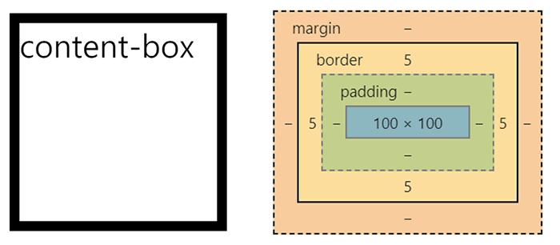
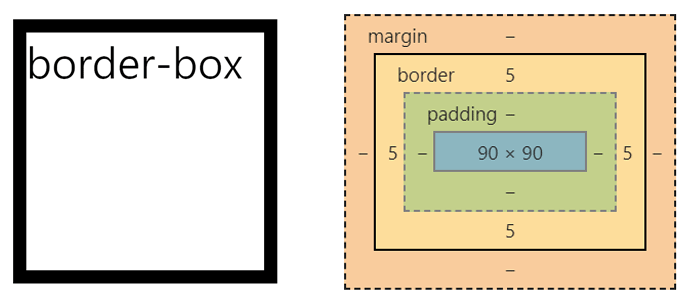

# Box-Sizing 속성에 대해 알아보자😁

- box-sizing은 박스의 크기를 어떤 기준으로 계산할 지 정하는 속성
- 기본값 : content-box

### content box

- 지정한 CSS width 및 height를 컨텐츠 영역에만 적용한다.
- border, padding, margin은 따로 계산되어 전체 영역이 설정값보다 커질 수 있다.

```
    <html>
        <head>
            <style>
                div {
                    border : 5px black solid;
                    width : 100px;
                    height : 100px;
                    box-sizing:content-box;
                }
            </style>
            <body>
                <div>content-box</div>
            </body>
        </head>
    </html>
```

padding: 0 , margin:0, border:5px, width:100px, height:100px 일때



전체 width = 5px + 100px + 5px = 110px
전체 height = 5px + 100px + 5px = 110px

content width= 100px;
content height= 100px;

- 모든 박스의 CSS 기본 속성값은 content-box이다.
- 초기 설정에서 width,height를 설정하면 컨텐츠 영역 이외의 padding, margin, border 값이 따로 계산되기 때문에 실제 설정한 값과 오차가 발생할 수 있다.

### border box

- 지정한 CSS width 및 height를 전체 영역에 적용한다.
- border, padding, margin을 모두 합산하기 때문에 컨텐츠 영역이 설정 값 보다 작아질 수 있다.

```
    <html>
        <head>
            <style>
                div {
                    border : 5px black solid;
                    width : 100px;
                    height : 100px;
                    box-sizing:border-box;
                }
            </style>
            <body>
                <div>border-box</div>
            </body>
        </head>
    </html>
```

padding: 0 , margin:0, border:5px, width:100px, height:100px 일때



전체 width = 5px + 90px + 5px = 100px
전체 height = 5px + 90px + 5px = 100px

content width = 90px
content height = 90px

전체적인 디자인 디테일 잡을때 유용한 속성이니 꼭 알아두자
