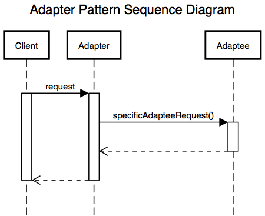

# Adapter

한 클래스의 인터페이스를 클라이언트에서 사용하고자 하는 다른 인터페이스로 변환하는 디자인 패턴

어댑터 패턴을 이용하면 인터페이스 호환성 문제 때문에 같이 쓸 수 없는 클래스들을 연결해서 쓸 수 있다.

# UML

;

- Client : 써드파티 라이브러리나 외부 시스템을 사용하려는 쪽

- Adaptee: 써드파티 라이브러리나 외부 시스템

- TargetInterface: Adapter가 구현 하려는 인터페이스. 클라이언트는 Target Interface를 통해 Adaptee인 써드파티 라이브러리를 사용하게 된다.

- Adapter: client와 Adaptee 중간에서 호환성이 없는 둘을 연결시켜주는 역할을 담당한다.

# 어댑터 패턴의 호출 과정

클라이언트는 Adapter에게 TargetInterface의 함수를 요청한다.
