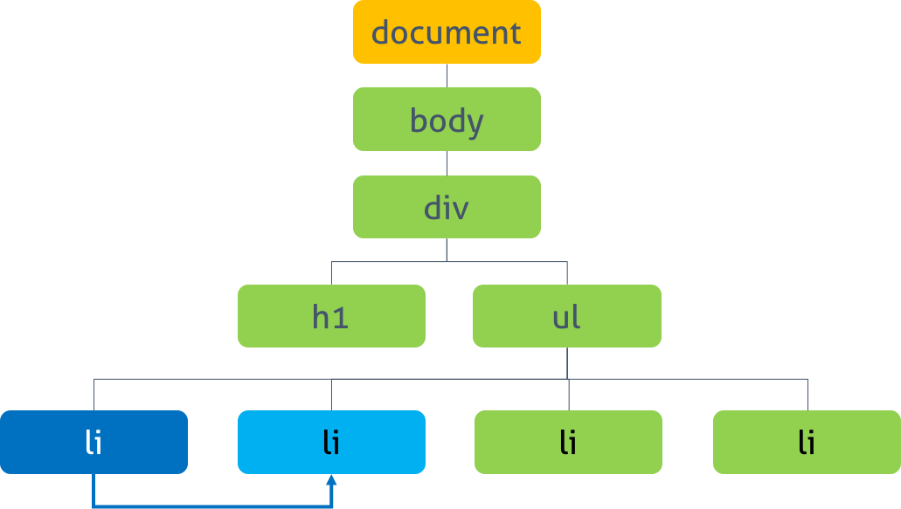

# DOM 그리고 레이아웃

## DOM (Document Object Model)

> DOM은 웹 브라우저로 부터 HTML,XML을 표현하기 위한 `인터페이스`를 제공한다. 이러한 인터페이스는 `웹의 구조나 스타일을 조작`할 수 있게 도와준다. DOM은 구조화된 `node`와 `property`와 `method`를 갖고 있는 `object`로 문서를 표현한다. 이들은 웹 페이지를 스크립트 또는 프로그래밍 언어들에서 사용될 수 있게 연결시켜주는 역할을 담당한다.

DOM에 대해 좀더 직관적으로 정의를 내리면 아래와 같다.

> 넓은 의미로는 웹브라우저가 html을 인식하는 방식  
> 좁은 의미로는 document 객체와 관련된 객체 집합

DOM은 자료구조중 트리 형식을 가지고 있으며 이를 DOM Tree라고 부른다.

## DOM이 생겨난 이유

### 태초에 웹은 문서를 공유하기 위해 만들어졌다.

웹은 문서를 공유하기 위해 만들어졌고, 해당 문서를 만들기 위해서 HTML이라는 문서에 마크업이라는 언어를 만들고 문서를 작성할 수 있게 되었다.

이후 서버에서 프로그래밍을 통해 HTML을 제작할 수 있는 PHP와 같은 서버 언어가 등장했고 이를 통해 컨텐츠를 포함한 HTML를 동적으로 생성할 수 있게 도와준다.

이 개념을 브라우저가 새로고침하지 않고 서버의 개입없이 브라우저 내부에서 동적으로 HTML을 변경하고자 자바스크립트가 탄생하였다.

## DOM의 문제점

DOM은 동적 UI에 최적화되어 있지 않다. DOM자체를 읽고 쓸 때의 성능은 자바스크립트 객체를 처리할 때 성능과 비교해서 크게 차이가 나지 않는다.
단, 브라우저 단에서 DOM변화가 일어난다면 브라우저가 CSS를 다시 연산한다음 레이아웃을 구성하고 렌더링하는데 시간이 요소된다.

화면에 그릴 수 있는 구조를 이미 만들어둔 상태에서 일부 변경된 화면을 만들기 위해 처음부터 다시 변경된 HTML을 분석하여 **다시 전부 구조를 만들어 적용하는 방식은 비효율적**이다.

그래서 최초 HTML을 통해 한번 구조를 만들면 다음번 변경은 HTML의 조작이 아닌 **이미 만들어진 구조에서 직접 일부를 수정하는 방식**을 사용해 훨씬 더 적은 비용으로 화면을 조작할 수 있게 되었다.

### 그래서 DOM이 필요하다.

DOM의 본질은 아래와 같다.

> **DOM = HTML을 수정하는 방법을 컴퓨터가 알아듣게 작성하는 방법**

> HTML을 동적으로 보다 효율적으로 변경하기 위해 **HTML 문서(document)**를 자바스크립트가 이해할 수 있는 **객체(object)**의 형태로 **모델링(model)**하여 자바스크립트에서 조작할 수 있도록 만든 **interface**가 바로 **DOM** 이다.

## DOM을 다루는 API

- getElementByTagName()  
   특정 태그를 가진 요소에 바로 접근가능.
- getElementById()  
   특정 아이디를 가진 요소에 바로 접근 가능.
- getElementByClassName()  
   특정 클래스를 가진 요소에 바로 접근 가능.
- createElement()  
   요소 생성
- appendChild()  
   선택된 노드에 자식으로 요소를 추가 가능
- removeChild()  
   특정 요소 삭제 가능
- getAttribute()  
   해당 요소의 속성값을 얻을 수 있음.
- setAttribute()  
   원하는 노드의 속성값을 바꿀 수 있음
