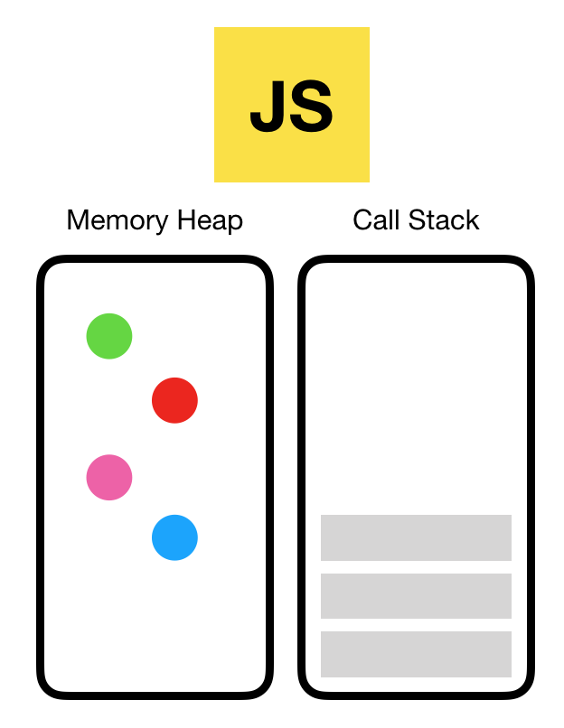
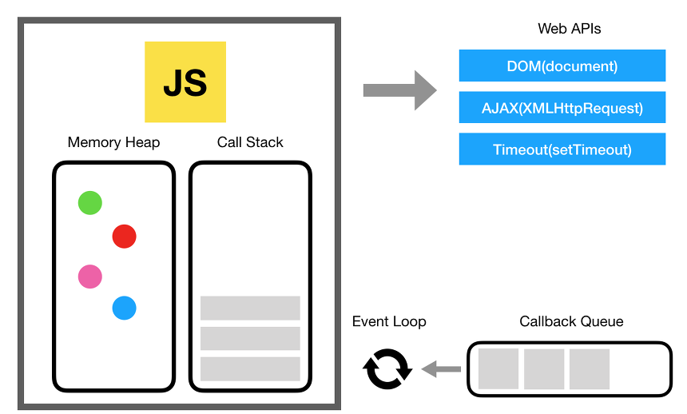

## 자바스크립트 호출스택 이해하기
<hr/>

<br>

### 자바스크립트 엔진

가장 대중적인 자바스크립트 엔진은 구글의 V8엔진이다.   
V8 엔진은 크롬과 노드 안에서 동작한다.   

자바스크립트 엔진은 다음과 같은 두 가지 주요 구성 요소로 이루어져 있다.

   


- 메모리 힙(Memory Heap): 객체는 힙, 대부분 구조화 되지 않은 메모리 영역에 할당된다.

- 호출 스택(Call Stack): 코드가 실행될 때 호출 스택이 쌓인다.

- 큐(Queue): 자바스크립트 런타임에는 처리할 메시지 목록과 실행할 관련 콜백함수인 메시지 대기열이 포함되어있다.

<br>

### 실행 환경(Runtime)
브라우저에는 자바스크립트 개발자가 사용하는 거의 모든 API가 있다. (ex: setTimeout)   
그러나 이런 API들을 엔진에서 제공해주지 않는다. 그렇다면 이 API는 어디서 오는 것일까?



브러우저는 단순히 엔진 하나만으로 구성되어 있지 않다. DOM, AJAX, setTimeout등의 브라우저에서 제공하는 Web API라고 하는것들이 있다.   
또한 이러한 Web API의 호출을 통제하기 위한 Event Queue와 Event Loop도 존재한다.

<br>

### 호출 스택(Call Stack)

자바스크립트는 **싱글 스레드 프로그래밍 언어**이므로 단일 호출 스택이 있다.   
단일 호출 스택이 있다는 것은 한번에 하나의 일(Task)만 처리할 수 있다는 뜻.   


호출 스택이란 프로그램에서 우리가 어디에 위치한지 기록하는 자료구조이다.   동작방식은 함수를 실행하면 해당 함수의 기록을 스택 맨 위에 **푸쉬(push)** 하고 우리가 함수를 리턴하면 스택에 쌓여있던 함수는 **팝(pop)** 된다.   

```javascript
    function multiply(x, y) {
        return x * y;
    }
    function printSquare(x) {
        var s = multiply(x, x);
        console.log(s);
    }
    printSquare(5);
```


<br>

### 스택 오버플로우

스택의 사이즈가 초과되었을 시 발생하는 오류.   
스택 오버플로우는 생각보다 쉽게 발생하는 오류이다. (특히 재귀 호출)

```javascript
    function foo() {
        foo();
    }
    foo();
```


<br>

### 단일 호출 스택의 문제점

자바스크립트에서는 하나의 호출 스택만 있기 때문에, 하나의 함수 처리가 매우 느려 다른 실행 함수에 지장을 줄 때는 어떻게 해야할 까?

답은 비동기 콜백을 사용하자.

<br>

### 비동기 콜백 (Asynchronous callbacks)

가장 쉬훈 해결책은 **비동기 콜백**을 사용하는 것이다. 즉 우리의 코드 일부를 실행하고 나중에 실행될 콜백(함수)를 제공한다.   
비동기 콜백은 즉시가 아닌, 특수한 시점에서 실행되므로 console.log와 같은 동기 함수와는 다르게 스택 안에 바로 push될 필요가 없다.   
그렇다면 이는 호출 스택에서 관리하는게 아니라 이벤트 큐에서 관리한다.

<br>

### 이벤트 큐 (Event Queue)

자바스크립트 실행환경은 이벤트 큐를 가지고 있다. 이는 처리 할 메시지 목록과 실행할 콜백 함수들의 리스트이다.