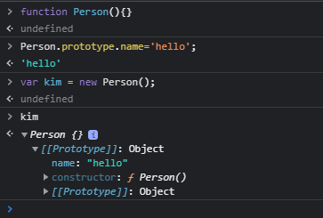

# 프로토타입 이해하기

## Prototype vs Class

클래스는 객체지향언어에서 빠질 수 없는 개념이다. 나무위키에 나와있는 자바스크립트의 특징을 보면 아래와 같이 말한다

> JavaScript는 클래스라는 개념이 없습니다. 그래서 기존의 객체를 복사하여(cloning) 새로운 객체를 생성하는 프로토타입 기반의 언어입니다. 프로토타입 기반 언어는 객체 원형인 프로토타입을 이용하여 새로운 객체를 만들어냅니다. 이렇게 생성된 객체 역시 또 다른 객체의 원형이 될 수 있습니다. 프로토타입은 객체를 확장하고 객체 지향적인 프로그래밍을 할 수 있게 해줍니다.

정리해보자면 자바스크립트의 객체지향형 프로그래밍은 함수 프로토타입에 기반한 객체지향 프로그래밍이다.

(참고로 ECMA6 표준에서는 Class문법이 추가되었지만 이는 Java나 C++의 Class와는 완전히 다른 개념이다)

자바스크립트는 함수와 new를 통해 Class를 흉내낼 수 있다.

```javascript
function Person() {
  this.age = 16;
  this.name = 'hello';
}

var kim = new Person();
var jeny = new Person();

console.log(kim.age); // 16;
console.log(jeny.age); //16;
```

이렇게 사용할 수 있는데 사실상 kim과 jeny는 age와 name을 공통으로 가지고 있는데 이렇게 되면 총 4개의 힙공간을 사용한다. 객체 100개를 만들면 200개의 공간이 할당된다는 말이다.  
바로 이런 문제를 프로토타입으로 해결할 수 있다.

```javascript
function Person() {}

Person.prototype.name = 'hello';
Person.prototype.age = 16;

var kim = new Person();
var jeny = new Person();

console.log(kim.age); //16
```

Person.prototype이라는 빈 Object가 어딘가에 존재하고 , Person 함수로 부터 생성된 객체들은 어딘가에 존재하는 Object를 참조하여 이 안에있는 값을 모두 사용할 수 있다.



### Prototype Link와 Prototype Object

자바스크립트에는 Prototype Link와 Prototype Object가 존재한다. 그리고 이 둘을 통틀어 **Prototype**이라고 부른다.

#### Prototype Object

객체는 언제나 함수로 생성된다

```javascript
function Person() {}
var person = new Person(); //함수로 객체를 생성
```

일반적인 객체생성도 실제적으로는 함수로 생성된다.

```javascript
var obj = {};
// 같음
var obj = new Object();
```
