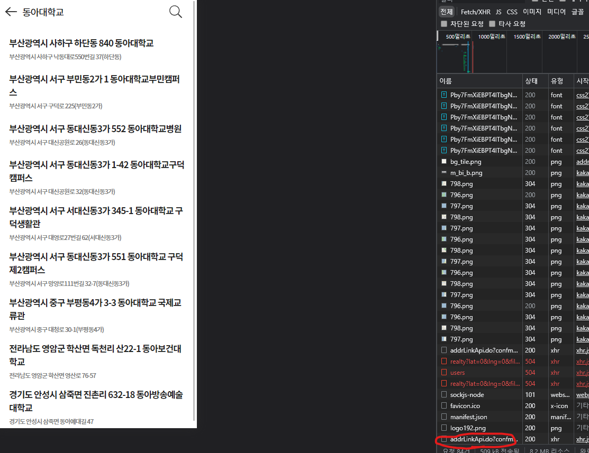

# Throttle 와 Debounce 개념정리

## 개념

scroll, resize, input, mosemove 같은 이벤트는 짧은 시간 간격으로 연속해서 발생한다. 이러한 이벤트에 바인딩한 이벤트 핸들러는 과도하게 호출되어 성능에 문제가 될 수 있다. 이벤트를 그룹화해서 과도한 이벤트 핸들러의 호출을 방지하는 프로그래밍 기법이다.

- 쓰로들링: 마지막 함수가 호출된 후 일정 시간이 지나기 전에 다시 호출되지 않도록 하는 것
- 디바운싱: 연이어 호출되는 함수들 중 마지막 (혹은 처음) 함수만 호출하도록 하는것

## 디바운스

실시간 검색이나 추천 검색어 등을 구현할 때 사용하는 기법

디바운싱을 적용하지 않으면 문자 한글자 한글자마다 api 요청이 일어나기 때문에 성능적인 측면에서 좋지 않다.
만약 유료 API를 사용한다고 하면 비용적인 측면에서도 매우 손해가 크다.

디바운싱을 리액트로 구현해보자.  
주소를 검색하는 api에 실시간으로 보여지게 하고싶다.

```js
import { useState, useEffect } from 'react'

function useDebounced(value: string, delay: number) {
  const [debouncedValue, setDebouncedValue] = useState < string > value

  useEffect(() => {
    const timer = setTimeout(() => {
      setDebouncedValue(value)
    }, delay)
    return () => {
      clearTimeout(timer)
    }
  }, [value, delay])

  return debouncedValue
}

export default useDebounced
```

우선 값이 변경되는 `temp`값을 하나 만들고 useEffect에서 `디바운싱`을 구현했다.
만약 timer가 없으면 상태를 변경하고 timer가 있으면 새로 만들었다.

```js
...
const debounceSearchTerm = useDebounced(addr, 500);

const onSerchAddr =(async address =>{
   ///api
})
useEffect(() => {
    onSearchAddr(debounceSearchTerm);
}, [debounceSearchTerm]);

```

위와 같이 작성하면 API요청을 최적화 할 수 있다.


## 스로틀

스로틀은 짧은 시간 간격으로 이벤트가 연속해서 발생하더라도 일정 시간 간격으로 이벤트 핸들러가 최대 한번만 호출되도록 한다. 즉 ,스로틀은 짧은 시간 간격으로 연속해서 발생하는 이벤트를 그룹화해서 일정 시간 단위로 이벤트 핸들러가 호출되도록 호출 주기를 만든다.

```html
<!DOCTYPE html>
<html>
  <head>
    <style>
      .container {
        width: 300px;
        height: 300px;
        background-color: rebeccapurple;
        overflow: scroll;
      }
      .content {
        width: 300px;
        height: 1000vh;
      }
    </style>
  </head>
  <body>
    <div class="container">
      <div class="content"></div>
    </div>
    <div>
      스로틀 이벤트 핸들러가 scroll 이벤트를 처리한 횟수:
      <span class="throttle-count">0</span>
    </div>
    <script>
      const $container = document.querySelector('.container')
      const $throttleCount = document.querySelector('.throttle-count')

      const throttle = (callback, delay) => {
        let timerId
        // throttle 함수는 timerId를 기억하는 클로저를 반환한다.
        return event => {
          if (timerId) return
          timerId = setTimeout(
            () => {
              callback(event)
              timerId = null
            },
            delay,
            event
          )
        }
      }
      let throttleCount = 0
      // throttle 함수가 반환하는 클로저가 이벤트 핸들러로 등록된다.
      $container.addEventListener(
        'scroll',
        throttle(() => {
          $throttleCount.textContent = ++throttleCount
        }, 100)
      )
    </script>
  </body>
</html>
```

`throttle` 함수가 반환한 함수는 두 번째 인수로 전달한 시간이 경과하기 이전에 이전에 이벤트가 발생하면 아무것도 하지않다가 delay 시간이 경과했을 때 이벤트가 발생하면 콜백함수를 호출하고 새로운 타이머를 재설정 한다.
