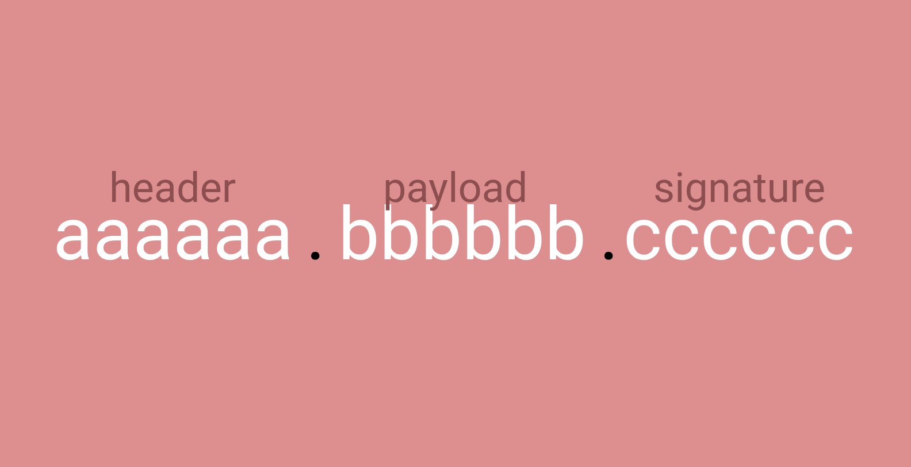
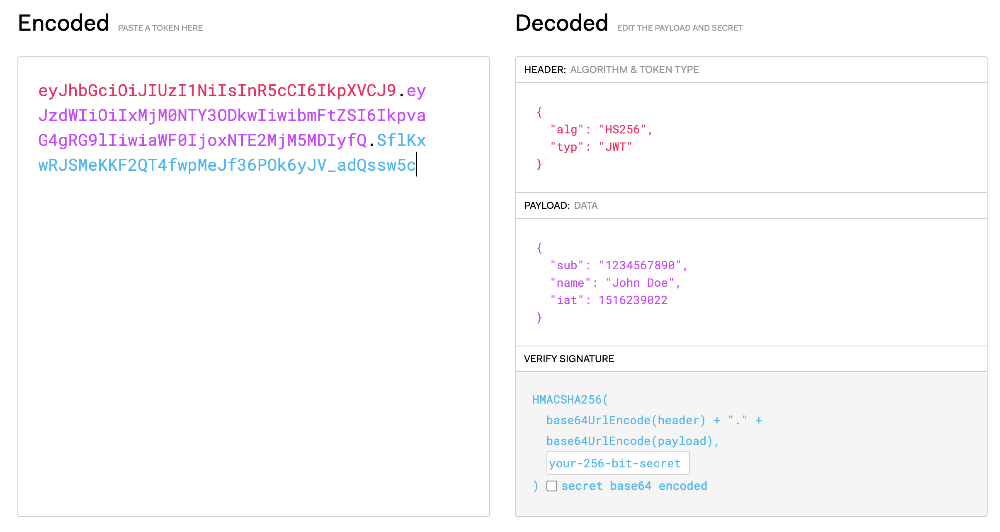

# JWT (JSON WEB TOEKEN)이란?

## HTTP

HTTP는 HyperText Tranfer Protocol의 약자로 데이터를 주고받기 위해 정의한 통신 프로토콜이다.

웹을 기준으로 브라우저와 서버간 데이터를 주고받기 위한 방식으로 HTTP 프로토콜을 사용하고 있다.

## HTTP의 특징

HTTP 프로토콜은 **상태를 유지하지 않는다.** 서버와 클라이언트는 첫 번째 통신이 끝나면 이전 통신에 대한 정보를 가지고 있지 않기 때문에 새롭게 갱신을 해주어야 한다. (이전에 보냈던 데이터와 다음에 보낼 데이터 요청이 서로 관련이 없다.)

그래서 **자신이 누구인지 계속해서 인증**을 해야 한다. 매번 서버에 사용자가 누구인지 인증하는 과정은 번거럽고 **웹페이지가 느려지는 원인**이 된다.

위의 원인과 이유로 사용자가 누구인지 인증하는 또다른 수단이 필요했다.

## JWT 토큰

**JWT**는 [웹표준 (RFC 7519)](https://datatracker.ietf.org/doc/html/rfc7519)으로 **전자 서명**된 URL-safe의 JSON이다.

;

### Header

```json
{
  "alg": "서명 시 사용하는 알고리즘",
  "kid": "서명 시 사용하는 키를 식별하는 값",
  "typ": "타입"
}
```

헤더에는 JWT를 어떻게 검증할 것인지에 대한 내용이 들어가있다.

### Payload

```json
{
  "sub": "hyeonsu.jung",
  "exp": 1623235123,
  "iat": 1532341234
}
```

토큰에 담아서 보내고자 하는 데이터가 이곳에 담겨져있다.  
이 정보의 조각은 `클레임`이라고 하고 `key-value`의 한 쌍으로 구성되어있다. 그리고 `payload`에는 여러개의 클레임을 담을 수 있고, 클래임을 공개(public)혹은 비공개(private)할 것인지 등록(registered)할 것인지 결정할 수 있다.

#### Signature

시그니처에는 위의 헤더와 페이로드를 합친 문자열을 서명한 값이다.
서명은 헤더의 `alg`에 정의된 알고리즘과 `secret key`를 이용해 생성하고 `base64 url-safe`로 인코딩 한다.


